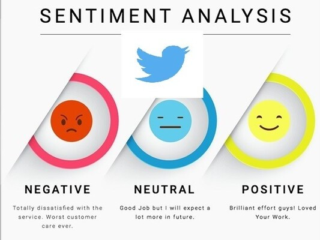

# Twitter_Sentiment_Analysis

A machine learning project that analyzes tweets to determine their sentiment (positive, negative, or neutral). It uses natural language processing (NLP) techniques for text preprocessing, feature extraction, and classification to gain insights into public opinion on various topics.

## Build & Track ML Pipelines with DVC

## How to run?

conda create -n "environment_name" python=3.11 -y

conda activate "environment_name"

pip install -r requirements.txt

## DVC Commands

git init

dvc init

dvc repro

dvc dag

dvc metrics show
